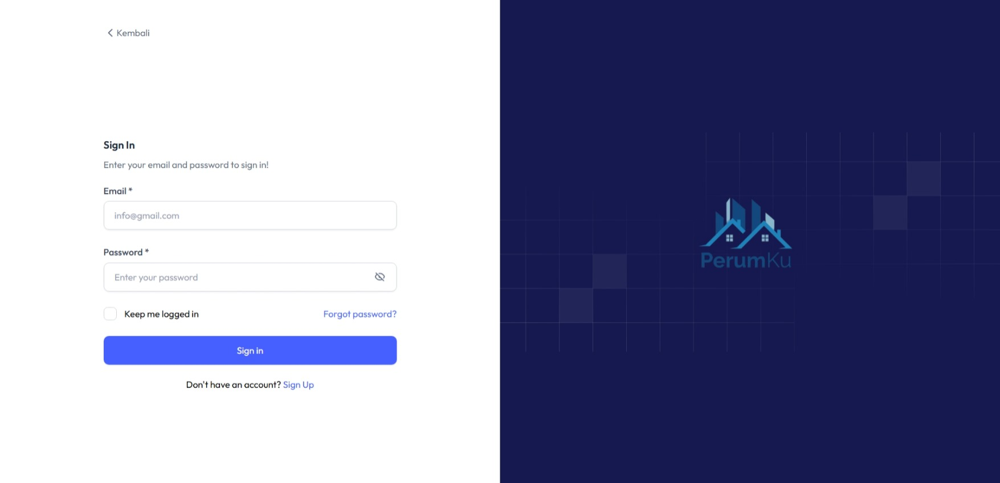
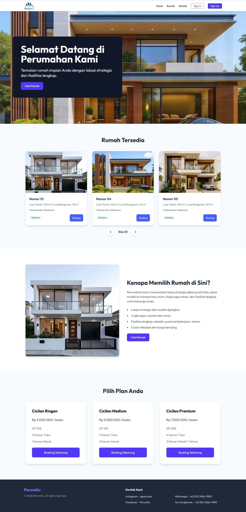
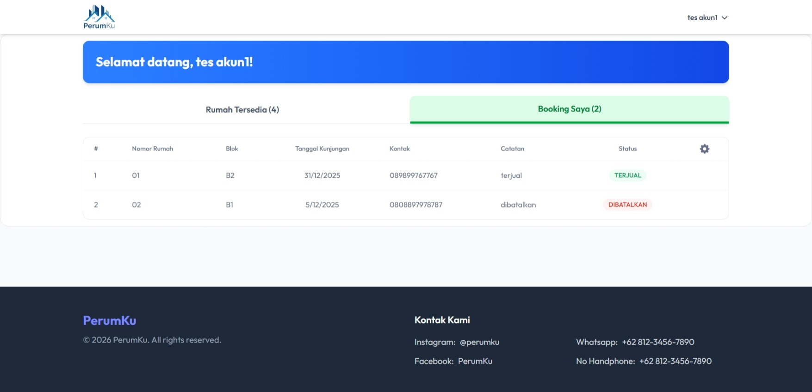

<h1 align="center">
🚀 Aplikasi Booking Perumahan
</h1>

<p align="center">
Aplikasi web modern menggunakan <b>ReactJS</b> (Vite + TypeScript) sebagai frontend  
dan <b>ExpressJS</b> sebagai backend API.
</p>

<p align="center">
  
  
  
  
</p>

---

## 🧩 Teknologi yang Digunakan

### Frontend
- ⚛️ ReactJS
- ⚡ Vite
- 🔷 TypeScript
- 🎨 CSS / Tailwind CSS

### Backend
- 🚂 ExpressJS
- 🔐 REST API
- 🗄️ Database MySQL

---

## ✨ Fitur Utama

- 🔐 Autentikasi Login (Admin & User)
- 🌐 Landing Page
- 📊 Dashboard Admin
- 👤 Dashboard User
- 🔄 Integrasi Frontend & Backend (REST API)
- 🏘️ Manajemen Blok dan Rumah
- 📅 Booking Rumah (Tanggal Kunjungan & Catatan)
- 📑 Manajemen Booking + Export ke Excel
- 👥 Manajemen Pengguna (Users)


---

## 📷 Tampilan Aplikasi

### 🔐 Halaman Login


### 🌐 Landing Page


### 🛠️ Dashboard Admin


### 👤 Dashboard User


---

## ⚙️ Cara Menjalankan Project

### 1️⃣ Clone Repository
```bash
git clone https://github.com/Farwezra9/Aplikasi-POS-Berbasis-Web.git
cd Aplikasi-POS-Berbasis-Web

